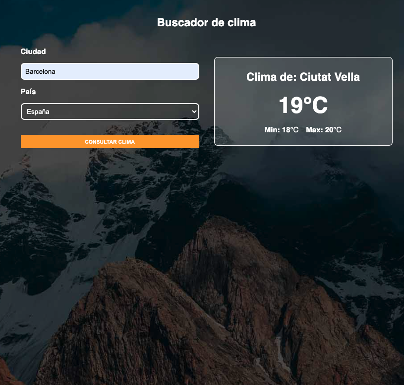

# ClimaApp — Consulta del Clima con Vue + OpenWeather API


---

## 📄 Descripción

**ClimaApp** es una aplicación desarrollada con **Vue 3** que permite consultar el estado del tiempo actual de cualquier ciudad mediante la API pública de **OpenWeather**. Ofrece una interfaz clara, manejo de errores, validación reactiva y un sistema de carga eficiente. Está diseñada con arquitectura modular y uso de composables personalizados.

---

## 🌐 Demo

🔗 [app-clima-vue](https://app-clima-vue-plum.vercel.app/)


---

## 🖼️ Capturas

#### Vista principal



---

## ✨ Funcionalidades

- Consulta del clima actual por ciudad y país
- Obtención automática de coordenadas con la API de geolocalización de OpenWeather
- Visualización del clima con temperatura, iconos y datos en tiempo real
- Formateo de temperatura en grados Celsius
- Indicador de carga y errores personalizados
- Arquitectura basada en composables (`useClima`)
- UI limpia y responsive

---

## 💻 Tecnologías Utilizadas

- **Vue.js 3**
- **Axios**
- **OpenWeather API**
- **CSS personalizado**
- **Vite**

---

## 📋 Requisitos

- Node.js v18 o superior
- API key de OpenWeather en archivo `.env`
- Git

---

## 🧱 Estructura del Proyecto

```bash
ClimaApp/
├── src/
│   ├── components/        # Alerta, Clima, Formulario, Spinner
│   ├── composables/       # useClima.js (lógica de consumo)
│   ├── style.css          # Estilos globales
│   ├── App.vue / main.js
├── vite.config.js
```

## 🛠️ Instalación

```bash
git clone https://github.com/eze-ms/App-Clima-API

```

### Instalar dependencias
```bash
npm install
```

### Iniciar servidor
```bash
npm run dev
```
---

© 2024. Proyecto desarrollado por Ezequiel Macchi Seoane